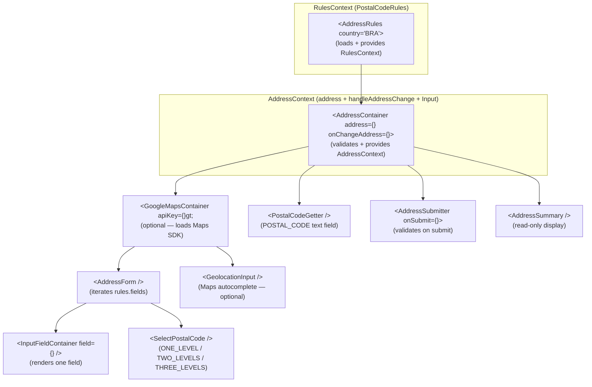
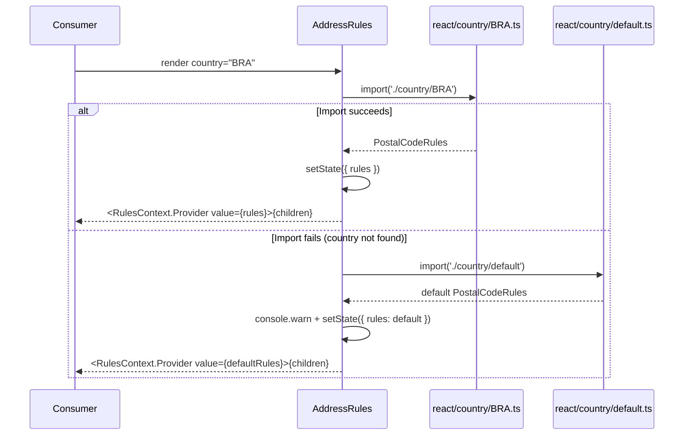
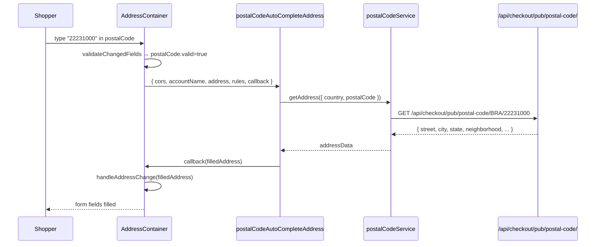

# address-form — App Baseline

> **Status**: Draft
> **Created**: 2026-05-12
> **Purpose**: Reverse-spec of the existing `vtex/address-form` application. Captures what the app currently does as a canonical reference for future specs, agent grounding, and onboarding. This spec is never "Approved" or "Done" — it is a living document updated when the app's architecture materially changes.

---

## 1. Business Context

### Problem Statement

VTEX merchants operate across 55+ countries, each with distinct address formats: different fields (CEP vs ZIP vs postcode), different validation rules, different postal code autocomplete APIs, and different administrative hierarchy depths (city-only vs city+state vs city+district+state). Storefront apps that need address input (checkout, shipping preview, returns) should not each re-implement this complexity.

`vtex/address-form` centralizes all country-specific address UI logic in a single composable library. Consumer apps mount `<AddressRules country="BRA">` + `<AddressContainer>` + `<AddressForm>` and get a fully country-aware, validated address entry experience.

### Goals

1. Provide a correct, production-grade address input experience for every VTEX-supported country.
2. Enable consumer apps to customize input rendering (via the `Input` prop) without forking business logic.
3. Expose a stable, versioned public API so consumers don't break on library updates.
4. Support both postal code autocomplete (server-side lookup) and geolocation (Google Maps) as address resolution strategies.

### User Stories

#### US-1: Enter address via postal code (shopper)

- **Story**: As a shopper, I want to type my postal code and have the remaining address fields filled automatically, so that I don't have to type my full address.
- **Acceptance Criteria**:
  - **Given** `<AddressRules country="BRA">`, **when** I type a valid Brazilian CEP (e.g. `22231-000`) in the postal code field, **then** `street`, `city`, `state`, and `neighborhood` are filled from the VTEX postal code API.
  - **Given** an invalid/incomplete postal code, **when** I blur the field, **then** no API call is made and the field shows a validation error.
  - **Given** the postal code API returns no result, **when** the call completes, **then** the field shows an error and other fields remain empty.
  - **Given** `autoCompletePostalCode={false}` on `<AddressContainer>`, **when** I type any postal code, **then** no API call is made.

#### US-2: Enter address via cascading selects (shopper — hierarchical countries)

- **Story**: As a shopper in a country without a postal code API (e.g. Ecuador), I want to select my state, city, and neighborhood from cascading dropdowns, so that I can specify my address without knowing a postal code.
- **Acceptance Criteria**:
  - **Given** `<AddressRules country="ECU">` (`postalCodeFrom: THREE_LEVELS`), **when** I select a state, **then** the city dropdown is populated with cities for that state.
  - **Given** a state and city selected, **when** I select a city, **then** the district/neighborhood dropdown is populated.
  - **Given** all levels selected, **when** I confirm, **then** `postalCode` is derived from the selection and the address is valid.

#### US-3: Enter address via geolocation (shopper)

- **Story**: As a shopper, I want to type a street address in a Google Maps autocomplete field, so that my address is resolved without me knowing my postal code.
- **Acceptance Criteria**:
  - **Given** `useGeolocation={true}` on `<AddressRules>` and a `<GoogleMapsContainer>` with a valid API key, **when** I type a partial address and select a suggestion, **then** `street`, `number`, `city`, `state`, and `postalCode` are filled from the geocoder response.
  - **Given** Google Maps is unavailable, **when** `<GoogleMapsContainer>` renders, **then** geolocation falls back gracefully (standard fields are shown).
  - **Given** a geocoded result has a field value that doesn't match the country rules, **when** the mismatch is detected, **then** `logGeolocationAddressMismatch` is called with the mismatch details.

#### US-4: Validate address on submit (app developer)

- **Story**: As an app developer, I want to validate the full address before sending it to the order form, so that I only submit addresses that satisfy country-specific field requirements.
- **Acceptance Criteria**:
  - **Given** a partially filled address, **when** `<AddressSubmitter>` fires submit, **then** `isValidAddress` is called, invalid fields get `valid: false` and `focus: true`, and the `onSubmit` callback is not called.
  - **Given** a fully valid address, **when** `<AddressSubmitter>` fires submit, **then** `onSubmit` is called with the validated address.
  - **Given** a required field is empty, **when** `validateField` is called, **then** the field returns `{ valid: false, reason: 'ERROR_EMPTY_FIELD' }`.

#### US-5: Render address summary (read-only)

- **Story**: As a shopper reviewing my order, I want to see my address formatted for my country, so that I can verify it before confirming.
- **Acceptance Criteria**:
  - **Given** a complete Brazilian address, **when** `<AddressSummary>` renders, **then** the address is formatted according to `rules.summary` (street + number + complement / neighborhood / city-state / CEP).
  - **Given** a field with `notApplicable: true`, **when** `<AddressSummary>` renders, **then** that field is omitted from the summary.

#### US-6: Select country (app developer)

- **Story**: As an app developer, I want to offer a country picker that resets the address form when the country changes, so that shoppers can switch markets cleanly.
- **Acceptance Criteria**:
  - **Given** `<CountrySelector>` is rendered, **when** the shopper selects a new country, **then** `onChangeAddress` is called with `{ country: { value: 'XYZ' } }` and `<AddressContainer>` short-circuits validation (no field validation on country change).
  - **Given** the new country is set, **when** `<AddressRules>` re-renders, **then** the new country's rules are loaded via dynamic `import()`.

#### US-7: Custom input rendering (app developer)

- **Story**: As an app developer, I want to pass a custom `Input` component to the form, so that the address fields render with my design system's style.
- **Acceptance Criteria**:
  - **Given** `Input={MyCustomInput}` on `<AddressContainer>`, **when** `<AddressForm>` renders, **then** every field uses `MyCustomInput` instead of `DefaultInput`.
  - **Given** no `Input` prop is passed, **when** `<AddressForm>` renders, **then** `DefaultInput` is used as the fallback.

#### US-8: Auto-complete fields display (shopper)

- **Story**: As a shopper who used postal code autocomplete, I want to see which fields were filled automatically and be able to clear them, so that I can correct an incorrect autocomplete result.
- **Acceptance Criteria**:
  - **Given** fields were filled by `postalCodeAutoCompleteAddress`, **when** `<AutoCompletedFields>` renders, **then** a summary of the auto-filled fields is shown.
  - **Given** the shopper clicks to edit, **when** the address changes, **then** the `postalCodeAutoCompleted` flag is cleared from the changed field.

### Key Scenarios

| Scenario | Pre-conditions | Steps | Expected Result |
|---|---|---|---|
| Brazilian CEP happy path | `country=BRA`, `postalCodeFrom=POSTAL_CODE`, API returns data | Type valid CEP → blur | `street`, `city`, `state`, `neighborhood` filled; form valid |
| CEP not found | `country=BRA`, API returns 404 | Type valid-format CEP → blur | Field shows `ERROR_POSTAL_CODE`; other fields unchanged |
| Country change clears validation | Valid address in BRA | Change country to ARG | `onChangeAddress` called with new country; no validation errors on old fields |
| Three-level cascade (ECU) | `country=ECU`, `postalCodeFrom=THREE_LEVELS` | Select state → city → district | `postalCode` derived; form valid |
| Geolocation autocomplete | `useGeolocation=true`, Maps loaded | Type address → select suggestion | All available fields filled from geocoder; mismatch logged if applicable |
| Geolocation Maps unavailable | `useGeolocation=true`, Maps fails to load | Render `<GoogleMapsContainer>` | Falls back to standard postal code form |
| Submit with missing required field | Form with empty `street` | Call `<AddressSubmitter>` submit | `street` gets `{ valid: false, focus: true }`; `onSubmit` not called |
| Custom Input component | `Input={StyleguideInput}` on container | Render `<AddressForm>` | All fields use `StyleguideInput`; `DefaultInput` never rendered |
| Unknown country fallback | `country=XYZ` (no rule file) | Render `<AddressRules country="XYZ">` | Falls back to `default.ts` rules; warning logged in non-production |
| Postal code with geolocation flag | Valid postal code with `geolocationAutoCompleted: true` | Change postal code field | `postalCodeAutoCompleteAddress` NOT triggered (guard flag present) |

### Functional Requirements

1. **Country rules loading** — `<AddressRules>` dynamically imports `react/country/<ISO3>.ts` on mount and on `country` prop change. Falls back to `default.ts` on import error.
2. **Postal code autocomplete** — `AddressContainer` calls `postalCodeAutoCompleteAddress` when a valid postal code is entered and `autoCompletePostalCode !== false` and `postalCodeField.postalCodeAPI === true`.
3. **Geolocation integration** — `<GoogleMapsContainer>` loads the Maps SDK and provides `googleMaps` via React context. `<GeolocationInput>` provides autocomplete. `getAddressByGeolocation` resolves coordinates to address fields.
4. **Real-time validation** — `validateChangedFields` runs on every `handleAddressChange` call. Field-level errors are reflected immediately.
5. **Country change short-circuit** — When `country.value` changes, `AddressContainer` passes the new address directly to `onChangeAddress` without running `validateChangedFields`.
6. **Custom input injection** — The `Input` prop on `<AddressContainer>` (or directly on `<AddressForm>`) is passed down through `AddressContext` to every `<InputFieldContainer>`.
7. **postalCodeFrom strategies** — `POSTAL_CODE`: text field with API; `ONE_LEVEL`: one select; `TWO_LEVELS`: two cascading selects; `THREE_LEVELS`: three cascading selects. `<SelectPostalCode>` dispatches to the correct sub-component.
8. **Address summary formatting** — `<AddressSummary>` renders fields according to `rules.summary[][]` (a 2D array of field groups, each group on one line).
9. **Address validation** — `isValidAddress`, `validateField`, `validateAddress`, `validateChangedFields` are the exported validation API. Validation respects field `required`, `regex`, `options`, and `optionsMap` from the country rules.
10. **Telemetry** — `logGeolocationAddressMismatch` fires via `window.logSplunk` when a geocoded field value doesn't match the expected country rules.
11. **Transforms** — `addValidation` wraps a flat `Address` in `ValidatedField` wrappers. `removeValidation` strips them. These are the canonical serialization utilities for consumers.

### Non-Functional Requirements

- React 16.x compatible (peerDep `15.x || 16.x`).
- Zero Redux dependency — all state via React Context.
- Country rule files are dynamically imported (code-split per country).
- The npm bundle (`react/lib/`) is CJS, targeting environments that already provide React, react-intl, prop-types, and vtex-tachyons as peers.
- `window.logSplunk` calls are fire-and-forget with try/catch — telemetry failures must not crash the form.
- No SSR support required — `document` and `window` are used directly.

### Out of Scope

- Checkout order form submission (that is `vtex.omnishipping`'s responsibility).
- Shipping SLA/price calculation.
- Pickup point selection.
- Address book management (listing, deleting saved addresses).
- Payment address (handled by separate payment flow).

---

## 2. Arch Decisions

### Proposed Solution

A React component library organized around two composable Context providers (`RulesContext` and `AddressContext`) and a dynamic country rules system. Consumers compose the library's components in a tree; the providers wire them together without prop-drilling.

### Architecture Overview



**Country rule loading sequence:**



**Postal code autocomplete sequence:**



### Alternatives Considered

| Alternative | Pros | Cons | Verdict |
|---|---|---|---|
| Redux for address state | Familiar to omnishipping team | Requires consumers to set up a store; adds weight to standalone npm use | Rejected — Context is sufficient for a form library |
| Single monolithic `<AddressForm>` | Simpler API | No composability; consumers can't inject postal code getter, summary, or submitter independently | Rejected — composable components allow flexible layout |
| Country rules as server-fetched JSON | Rules can be updated without releasing | Adds network dependency; slower TTI; complicates error handling | Rejected — static imports allow code-splitting and offline use |
| Inline all country rules in one bundle | Simpler loading | 55+ country files × average 3KB = ~165KB extra in the main bundle | Rejected — dynamic `import()` keeps initial bundle lean |
| Replace axios with fetch | Removes one runtime dependency | Fetch requires polyfill in older VTEX storefront environments; axios interceptors useful for test mocking | Deferred — not worth the migration risk today |

### Risks & Mitigations

| Risk | Impact | Likelihood | Mitigation |
|---|---|---|---|
| Breaking `PostalCodeRules` type shape | High — all consumers break | Med | Public API discipline rule 30; major version bump required |
| Incorrect country rule (wrong regex/mask) | High — wrong UX for an entire market | Med | Mandatory unit test for every country file; demo app manual QA |
| Google Maps SDK load failure | Med — geolocation unavailable | Med | `GoogleMapsContainer` catches load errors and renders children without Maps context |
| Postal code API timeout | Med — form hangs | Low | `axios` timeout configuration; `postalCodeAutoCompleteAddress` handles promise rejection |
| npm publish with wrong lib/ build | High — consumers get stale code | Low | `prepublishOnly` script runs `yarn build`; `publish-release.sh` orchestrates the release |
| Version skew between manifest.json and react/package.json | Med — confusing releases | Low | `publish-release.sh` bumps both atomically; constitution enforces lockstep |

### Key Decisions

#### Decision 1: Dual public API surfaces (IO app + npm package)

- **Status**: Accepted
- **Context**: `vtex.address-form` must work both as a VTEX IO peer dep (where the IO framework resolves components via `react/components.ts`) and as an independent npm package (where consumers import from `@vtex/address-form` via `react/index.ts`).
- **Decision**: Maintain two distinct entry points — `react/components.ts` (VTEX IO component map, default export object) and `react/index.ts` (npm named exports). Both are public API surfaces governed by rule 30.
- **Consequences**: Two surfaces to maintain and version in lockstep. Any new component added to one should be evaluated for the other. Rollup builds from `react/index.ts` → `react/lib/`.

#### Decision 2: React Context over Redux

- **Status**: Accepted
- **Context**: `vtex.shipping-manager` owns the Redux store for the checkout shipping step. `address-form` is a standalone library that must also work outside Redux-managed apps (e.g., returns, npm consumers).
- **Decision**: All state is managed via React Context (`RulesContext`, `AddressContext`). No Redux dependency.
- **Consequences**: Consumers that use Redux must bridge the state themselves (e.g., by passing `address` from Redux state as a prop to `<AddressContainer>`). The library remains dependency-light for npm consumers.

#### Decision 3: Dynamic country rule imports

- **Status**: Accepted
- **Context**: 55+ country rule files, each ~2–10KB. Bundling all statically would add significant weight to every consumer's main chunk.
- **Decision**: `AddressRules.tsx` uses `import('./country/<ISO3>')` (dynamic import) so each country file is a separate code-split chunk loaded on demand.
- **Consequences**: Async loading; `AddressRules` renders nothing until the rules promise resolves. Consumers must handle the brief null render (typically unnoticeable on fast connections). Bundlers (Rollup, webpack) must support dynamic imports.

#### Decision 4: `injectRules` and `injectAddressContext` HOCs alongside hooks

- **Status**: Accepted
- **Context**: Legacy class components in consumers cannot use hooks (`useAddressRules`, `useAddressContext`). Both patterns must coexist.
- **Decision**: Export both `injectRules` / `injectAddressContext` HOCs (for class components) and `useAddressRules` / `useAddressContext` hooks (for function components). Both read from the same contexts.
- **Consequences**: Two usage patterns to document and test. New internal components should use hooks. Existing components using HOCs are not migrated unless the PR scope includes migration.

#### Decision 5: `postalCodeFrom` as a strategy enum in country rules

- **Status**: Accepted
- **Context**: Countries resolve postal codes in four fundamentally different ways. The rendering approach (text input vs. cascading selects) must be driven by data, not hardcoded per country.
- **Decision**: Each country rule file declares `postalCodeFrom: POSTAL_CODE | ONE_LEVEL | TWO_LEVELS | THREE_LEVELS`. `SelectPostalCode` dispatches to `OneLevel`, `TwoLevels`, or `ThreeLevels` sub-components based on this value.
- **Consequences**: New postal code strategies require a new constant, a new sub-component, and updates to `SelectPostalCode`. The `PostalCodeRules` type must include the new strategy string.

### Implementation Plan

This is an existing, stable app. The baseline is already implemented. Future work follows the SDD Lite pipeline for most tasks and SDD Full for public API changes. Priorities:

1. New country support → SDD Lite (new country rule file + unit test).
2. Bug fixes in validation → SDD Lite (regression test + fix).
3. Breaking API changes → SDD Full (cross-repo coordination required).

---

## 3. Technical Contract

### Data Models

#### Address (raw, from order form)

```typescript
interface Address {
  addressId: string
  addressType: 'residential' | 'search' | 'pickup' | 'giftRegistry' | 'instore' | 'commercial'
  postalCode?: string | null
  country?: string | null
  street?: string | null
  number?: string | null
  complement?: string | null
  city?: string | null
  state?: string | null
  neighborhood?: string | null
  reference?: string | null
  isDisposable?: boolean | null
  geoCoordinates?: number[] | null
  receiverName?: string | null
  addressQuery?: string | null
}
```

#### AddressWithValidation (form state)

```typescript
type AddressWithValidation = {
  [field in keyof Address]: ValidatedField<Address[field]>
}

interface ValidatedField<Value> {
  value?: Value | null
  valueOptions?: string[]
  valid?: boolean
  reason?: string          // error code: EEMPTY, ENOTOPTION, ECOUNTRY, etc.
  visited?: boolean
  focus?: boolean
  disabled?: boolean
  postalCodeAutoCompleted?: boolean
  geolocationAutoCompleted?: boolean
  notApplicable?: boolean
}
```

#### PostalCodeRules (country rule shape)

```typescript
interface PostalCodeRules {
  country: string | null
  abbr: string | null                   // 2-letter ISO code (for Google Maps)
  postalCodeFrom?: PostalCodeSource     // POSTAL_CODE | ONE_LEVEL | TWO_LEVELS | THREE_LEVELS
  postalCodeLevels?: FillableFields[]
  postalCodeProtectedFields?: string[]  // fields overwritten by postal code API
  firstLevelPostalCodes?: ...
  secondLevelPostalCodes?: ...
  thirdLevelPostalCodes?: ...
  fields: PostalCodeFieldRule[]         // ordered list of address fields
  geolocation?: GeolocationRules        // overrides for fields when useGeolocation=true
  summary?: PostalCodeSummaryLine[][]   // 2D layout for AddressSummary
}
```

#### PostalCodeFieldRule (per-field config)

```typescript
type PostalCodeFieldRule = {
  name: FillableFields               // field key (street, city, state, etc.)
  label?: string                     // i18n key
  fixedLabel?: string                // literal label (not i18n'd)
  size?: 'mini' | 'small' | 'medium' | 'large' | 'xlarge'
  required?: boolean
  hidden?: boolean
  mask?: string                      // e.g. '99999-999' for BRA CEP
  regex?: string | RegExp
  maxLength?: number
  postalCodeAPI?: boolean            // triggers postal code autocomplete when true
  autoComplete?: boolean | string
  autoUpperCase?: boolean
  options?: string[]                 // for select fields
  optionsPairs?: Array<{ label: string; value: string }>
  optionsMap?: ...                   // for cascading selects
  forgottenURL?: string              // "forgot my postal code" link
  basedOn?: Fields                  // cascading dependency
  level?: number                    // cascade level (1, 2, 3)
  notApplicable?: boolean
  elementName?: string
  defaultValue?: unknown
}
```

#### Error Codes

```typescript
const EEMPTY     = 'ERROR_EMPTY_FIELD'       // required field is empty
const EADDRESSTYPE = 'ERROR_ADDRESS_TYPE'    // invalid addressType value
const ENOTOPTION = 'ERROR_VALUE_IS_NOT_AN_OPTION'  // value not in options list
const ECOUNTRY   = 'ERROR_COUNTRY_CODE'      // invalid country code
const EGEOCOORDS = 'ERROR_GEO_COORDS'        // invalid geoCoordinates
const EPOSTALCODE = 'ERROR_POSTAL_CODE'      // postal code API error
const EGOOGLEADDRESS = 'ERROR_GOOGLE_ADDRESS' // Google Maps geocoder error
```

### Interfaces

#### npm package public API (`react/index.ts`)

```typescript
// Components
export { AddressContainer }       // Context provider: validates, triggers autocomplete
export { AddressForm }            // Renders all fields per country rules
export { AddressRules }           // Loads country rules, provides RulesContext
export { AddressSubmitter }       // Validates on submit
export { AddressSummary }         // Read-only address display
export { AutoCompletedFields }    // Shows postal-code-filled fields
export { CountrySelector }        // Country picker
export { PostalCodeGetter }       // Postal code text field

// Component registry
export { default as components }  // Same as react/components.ts

// Helper functions
export { addValidation }          // (address: Address, rules) => AddressWithValidation
export { removeValidation }       // (address: AddressWithValidation) => Address
export { isValidAddress }         // (address, rules) => { valid: boolean, address: AddressWithValidation }
export { validateField }          // (value, name, address, rules) => { valid, reason }
export { injectRules }            // HOC: wraps component with RulesContext consumer
export { injectAddressContext }   // HOC: wraps component with AddressContext consumer
export { default as helpers }     // { addValidation, removeValidation, isValidAddress, validateField, injectAddressContext, injectRules, getAddressByGeolocation }

// Types (re-exported)
export type { Address, AddressWithValidation, ValidatedField, AddressType, Fields, FillableFields }
export type { PostalCodeRules, PostalCodeFieldRule, PostalCodeSource, GeolocationRules }
```

#### VTEX IO component map (`react/components.ts`)

```typescript
export default {
  AddressContainer,
  AddressForm,
  AddressRules,
  AddressSubmitter,
  AddressSummary,
  AutoCompletedFields,
  CountrySelector,
  GoogleMapsContainer,
  Map,
  PostalCodeGetter,
  PostalCodeLoader,
  StyleguideInput,
  StyleguideButton,
}
```

#### Input registry (`react/inputs.ts`)

```typescript
export default {
  DefaultInput,       // Unstyled default
  GeolocationInput,   // Google Maps autocomplete input
  InputError,
  InputLabel,
  InputSelect,
  InputText,
  StyleguideInput,    // VTEX Styleguide-styled input
}
```

#### Key component props

```typescript
// AddressRules
interface AddressRulesProps {
  country: string              // ISO3 code (e.g. 'BRA', 'USA')
  fetch?: (country: string) => Promise<PostalCodeRules>  // custom rule fetcher
  shouldUseIOFetching?: boolean  // use VTEX IO built-in module resolution
  useGeolocation?: boolean     // merge geolocation overrides into rules.fields
  children: ReactNode
}

// AddressContainer
interface AddressContainerProps {
  address: AddressWithValidation
  rules: PostalCodeRules       // usually injected by injectRules HOC
  onChangeAddress: (address: AddressWithValidation, ...args: any[]) => void
  Input?: React.ComponentType  // custom input renderer
  cors?: boolean               // use cross-origin postal code API URL
  accountName?: string         // required when cors=true
  autoCompletePostalCode?: boolean  // default: true
  shouldHandleAddressChangeOnMount?: boolean  // default: false
  shouldAddFocusToNextInvalidField?: boolean  // default: true
  children: ReactNode
}

// AddressForm
interface AddressFormProps {
  address: AddressWithValidation  // from AddressContext
  rules: PostalCodeRules          // from RulesContext
  onChangeAddress: (changed: Partial<AddressWithValidation>) => void
  Input?: React.ComponentType
  omitPostalCodeFields?: boolean
  omitAutoCompletedFields?: boolean
  className?: string
  notApplicableLabel?: string
}
```

#### Validation functions

```typescript
// Validate a single field
function validateField(
  value: AddressValues,
  name: Fields,
  address: AddressWithValidation,
  rules: Rules
): { valid: boolean; reason?: string }

// Validate all changed fields (called by AddressContainer on every change)
function validateChangedFields(
  changedAddressFields: Partial<AddressWithValidation>,
  address: AddressWithValidation,
  rules: Rules
): AddressWithValidation

// Validate the entire address (called by AddressSubmitter on submit)
function validateAddress(
  address: AddressWithValidation,
  rules: Rules
): AddressWithValidation

// Check if all required fields are valid; focus first invalid field
function isValidAddress(
  address: AddressWithValidation,
  rules: Rules
): { valid: boolean; address: AddressWithValidation }
```

#### Postal code service

```typescript
// Called by postalCodeAutoCompleteAddress (not exported directly)
function getAddress(params: {
  cors?: boolean
  accountName?: string
  country: string
  postalCode: string
}): Promise<Partial<Address>>
// → GET /api/checkout/pub/postal-code/<country>/<postalCode>
// → or GET https://<accountName>.vtexcommercestable.com.br/api/checkout/pub/postal-code/...
```

#### Geolocation utilities

```typescript
// Entry point for geolocation-to-address resolution
function getAddressByGeolocation(props: {
  address: AddressWithValidation
  onChangeAddress: (address: AddressWithValidation) => void
  rules: PostalCodeRules
  googleMaps: typeof google.maps
}): void  // async, fires onChangeAddress when done

// Maps Google geocoder result → AddressWithValidation
function geolocationAutoCompleteAddress(
  address: AddressWithValidation,
  googleAddress: google.maps.GeocoderResult,
  rules: PostalCodeRules,
  useGeolocation?: boolean
): AddressWithValidation
```

#### Telemetry

```typescript
// Logs a geolocation field mismatch to Splunk
function logGeolocationAddressMismatch(data: {
  fieldValue: AddressValues | null
  fieldName: Fields
  countryFromRules: string | null
  address: Record<string, any>
}): void
// → window.logSplunk({ level: 'Debug', type: 'Warning', workflowType: 'address-form', ... })
```

### Integration Points

| System | Direction | How | Details |
|---|---|---|---|
| VTEX Checkout Postal Code API | Outbound | `axios` GET | `/api/checkout/pub/postal-code/<country>/<postalCode>` — returns street, city, state, neighborhood |
| Google Maps JavaScript SDK | Outbound | `load-google-maps-api` npm package | Loaded by `GoogleMapsContainer`; used for autocomplete input and geocoding |
| `vtex.omnishipping` | Consumer | VTEX IO peer dep + `injectRules` / context | Mounts `<AddressRules>` + `<AddressContainer>` + `<AddressForm>` in the checkout shipping step |
| `vtex.shipping-preview` | Consumer | VTEX IO peer dep | Mounts `<AddressRules>` + `<PostalCodeGetter>` for postal code entry on the cart page |
| `vtex.checkout` | Consumer | VTEX IO peer dep | Mounts address components during the checkout address step |
| `@vtex/address-form` (npm) | Consumer | `import { AddressRules, ... } from '@vtex/address-form'` | Non-IO consumers import from the CJS bundle in `react/lib/` |
| `window.logSplunk` | Outbound | Direct window call | Splunk telemetry for geolocation mismatch events; guarded by try/catch |
| `vtex.country-codes` | Peer dep | VTEX IO | Used by `CountrySelector` to resolve country names and codes |
| Crowdin | i18n sync | `crowdin.yml` | Translates `messages/en.json` to 25+ locale files (`%two_letters_code%.json`) |
| `@vtex/intl-equalizer` | Dev tooling | `yarn lint:locales` | Enforces key parity across all locale files; reference locale `pt` |

### Invariants & Constraints

1. **Two-Context model is immutable** — `RulesContext` and `AddressContext` are the only state-sharing mechanism. No global variables, no Redux, no module-level state.
2. **Country rules are always loaded before rendering** — `<AddressRules>` renders `null` until the async import resolves. No child should assume `rules` is available synchronously.
3. **`react/index.ts` exports are the npm contract** — removing, renaming, or changing any export requires a major version bump (both `manifest.json` and `react/package.json`) and consumer coordination.
4. **`react/components.ts` keys are the IO contract** — same policy as invariant 3.
5. **`PostalCodeRules` shape is frozen** — changing any field in `PostalCodeFieldRule` or `PostalCodeRules` is a breaking change for all consumers.
6. **Postal code API calls flow through `postalCodeService.js`** — no component may call the API directly.
7. **`en.json` is the only manually edited locale** — all other locale files are Crowdin-managed.
8. **Yarn only** — no npm, no pnpm. `react/` has its own `package.json` with a separate `yarn.lock`.
9. **Test runner is `yarn --cwd react test`** — not at repo root. The Jest config lives in `react/package.json`.
10. **Version lockstep** — `manifest.json` version and `react/package.json` version must always be identical after a release. Divergence is a bug.
11. **`window.logSplunk` calls must not be removed** without a follow-up telemetry task being filed.
12. **No SSR** — `document` and `window` are used directly in `postalCodeService.js` and `metrics.ts`. Do not add SSR support without a spec.
