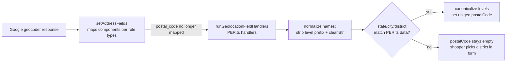

# Peru geolocation: always resolve ubigeo, never leak Google's CPN

> **Status**: Draft
> **Created**: 2026-07-30
> **References**: Zendesk #1290373, Jira [LOC-21884](https://vtex-dev.atlassian.net/browse/LOC-21884), Zendesk #1287333 (background)

## 1. Business Context

### Problem Statement

Peru has two numbering systems: the 6-digit INEI **ubigeo** (department/province/district code, used by `PER.ts` and by every VTEX store's shipping configuration) and the official 5-digit **CPN** postal code (Serpost/MTC, barely used in practice but the one Google Maps returns in the `postal_code` component).

When a shopper uses geolocation in checkout, the Google `postal_code` (CPN) is copied into the address. A country-rule handler is supposed to overwrite it with the ubigeo, but the handler's lookup requires an **exact string match** of department, province and district against `PER.ts` country data. Google prefixes province names ("Provincia de Chincha") and accents district names ("Jesús María"), so the lookup fails for most of Peru outside Lima (the only special-cased province). The CPN then passes the field regex (`/^\d{5,6}$/`) and ships to the orderForm.

Reported case (Zendesk #1290373, account `florayfauna`): the address *Calle Sucre 655, Chincha Alta – Chincha – Ica* gets postal code `11701` (CPN), which does not exist in `PER.ts` (`110201` is the ubigeo). Merchants configure shipping from the `PER.ts` list, so orders carrying CPN codes cannot be matched to any shipping rate.

Peruvian CXs confirmed that **ubigeo must remain the canonical "postal code" for Peru** — all store shipping configurations depend on it, and switching to CPN would break every Peru store.

### Goals

- Geolocation-completed addresses in Peru always carry a 6-digit ubigeo from the Peru country data, or no postal code at all — never a Google CPN.
- Geolocation autocomplete resolves the ubigeo for provinces outside Lima (prefix and accent tolerant matching).
- Peru ubigeo country data stays aligned with current INEI districts (shipping configurations continue to use ubigeos).

### User Stories

#### US-1: Shopper completes address via geolocation outside Lima

- **Story**: As a shopper in Chincha Alta (Ica), I want geolocation to fill my address with the ubigeo my store's shipping is configured for, so that my order gets shipping options.
- **Acceptance Criteria**:
  - **Given** Google returns state `Ica`, province `Provincia de Chincha`, district `Chincha Alta` and postal code `11701`, **when** geolocation autocomplete runs, **then** the address holds state `Ica`, city `Chincha`, neighborhood `Chincha Alta` and postal code `110201`.
  - **Given** Google returns a district that does not exist in `PER.ts`, **when** geolocation autocomplete runs, **then** the address postal code is empty (never `11701`), and the shopper picks the district from the form dropdowns, which derives the ubigeo.

#### US-2: Merchant aligns shipping configuration with checkout

- **Story**: As a merchant operating in Peru, I want checkout to only ever emit postal codes present in `PER.ts`, so that my shipping spreadsheet built from that list always matches.
- **Acceptance Criteria**:
  - **Given** any Google geocoder response for a Peruvian address, **when** the address is completed via geolocation, **then** `postalCode` is either a value present in `PER.ts` country data or empty.

### Key Scenarios

| Scenario | Pre-conditions | Steps | Expected Result |
|---|---|---|---|
| Happy path: prefixed province | Google returns `Ica` / `Provincia de Chincha` / `Chincha Alta`, CPN `11701` | Geolocation autocomplete runs | `postalCode = 110201`; levels canonicalized to `Ica` / `Chincha` / `Chincha Alta` |
| Happy path: accented district | Google returns `Lima` / `Provincia de Lima` / `Jesús María` | Geolocation autocomplete runs | Matches unaccented data key `Jesus Maria`; `postalCode = 150113` |
| Error case: unknown district | Google returns a district absent from `PER.ts` | Geolocation autocomplete runs | `postalCode` stays empty; CPN from Google is never copied; form dropdowns let the shopper resolve the district |
| Edge case: Lima metro | Google returns `Provincia de Lima` / `Distrito de Lima` | Geolocation autocomplete runs | Existing behavior preserved: `Lima` / `Lima` / `Lima`, `postalCode = 150101` |
| Edge case: Callao | Google returns `Callao` / `Provincia Constitucional del Callao` / `Bellavista` | Geolocation autocomplete runs | `postalCode = 070102` |
| Edge case: non-department in level 1 | Google's `administrative_area_level_1` matches no department | Geolocation autocomplete runs | Department inferred from the province name (accent/prefix tolerant) |

### Functional Requirements

- Remove the mapping of Google's `postal_code` component for Peru: `types` omitted from the `postalCode` geolocation rule so `setAddressFields` never copies the CPN.
- The `postalCode` geolocation handler derives the ubigeo by resolving department → province → district against `PER.ts` country data with normalization: strip level prefixes (`Provincia de`, `Provincia Constitucional del`, `Departamento de`, `Distrito de`, `Región de`), lowercase, and remove diacritics (`cleanStr`).
- On a successful three-level match, canonicalize `state`, `city` and `neighborhood` values to the `PER.ts` keys so they match the form dropdown options.
- Generalize the Lima-only special cases in the `state`, `city` and `neighborhood` handlers to all departments/provinces/districts.
- Fix the `Mi Perú` (Callao) ubigeo data typo: `07056` → `070107`.
- Refresh Peru country data from INEI 2025 into `react/country/data/PER.json` (1,891 districts): add missing districts, remove obsolete Maynas entries moved to Putumayo province, and keep Callao only as its own department.

### Non-Functional Requirements

- No public API changes (`react/index.ts`, `react/components.ts` untouched) — minor/patch release, no consumer coordination needed.
- Existing test suite passes unchanged (no snapshot updates required).

### Out of Scope

- Switching Peru to CPN postal codes or adding a CPN↔ubigeo mapping (rejected by CXs — would break all Peru shipping configurations).
- Tightening the `postalCode` field regex from `/^\d{5,6}$/` to `/^\d{6}$/`. With the CPN leak closed, no new 5-digit codes can enter; tightening would invalidate previously saved addresses that carry leaked CPNs, forcing shoppers to re-enter them. Flagged as a possible follow-up once leaked-code volume is measured.
- Checkout-side or Logistics-side handling of already-stored CPN addresses.

---

## 2. Arch Decisions

### Proposed Solution

Keep ubigeo as the canonical postal code for Peru and make the geolocation flow airtight at the country-rules level (`react/country/PER.ts` only):

1. Google's `postal_code` component is never mapped into the address (no `types` on the rule).
2. The ubigeo is derived exclusively from the `PER.ts` three-level dataset via a normalized, prefix/accent-tolerant lookup (`findCountryDataKey` helper using the existing `cleanStr` selector).
3. Level handlers canonicalize Google names to dataset keys so dropdowns and the `THREE_LEVELS` postal-code derivation stay consistent.

### Architecture Overview

### Alternatives Considered

| Alternative | Pros | Cons | Verdict |
|---|---|---|---|
| Switch `PER.ts` to 5-digit CPN codes (match Google) | Aligns with Google and the official postal standard | Breaks every Peru store's shipping configuration; CPN barely used in practice | Rejected (CXs) |
| Add a CPN→ubigeo mapping table | Could translate Google's code directly | Large dataset to maintain; CPN↔district is not 1:1 (e.g. `11701` covers two districts); still needs name matching as fallback | Rejected — name-based resolution is simpler and already required |
| Keep mapping Google's CPN but clear it in the handler on lookup failure | Smaller diff | CPN would still ship whenever the handler doesn't run or a future refactor reorders handlers; mapping a value only to discard it is fragile | Rejected in favor of not mapping at all |
| Tighten field regex to `/^\d{6}$/` | Hard guarantee at validation level | Invalidates existing saved addresses carrying leaked CPNs | Deferred (follow-up) |

### Risks & Mitigations

| Risk | Impact | Likelihood | Mitigation |
|---|---|---|---|
| Google name variants not covered by prefix/accent normalization | Med (field stays empty, shopper selects manually — no wrong code) | Med | Failure mode is now safe-by-default; monitor support tickets for recurring variants and extend normalization |
| Department inference from province picks the wrong department for duplicate province names | Low | Low | Inference only runs when Google's level-1 matches no department; direct department match takes precedence (stricter than previous behavior) |
| Behavior change for addresses that previously shipped CPN codes | Med | High (that's the fix) | Merchants were already unable to match CPN codes to shipping; empty-or-ubigeo is strictly better |

### Key Decisions

#### Decision 1: Ubigeo remains the canonical postal code for Peru

- **Status**: Accepted
- **Context**: Google returns CPN; VTEX stores are configured on ubigeo; the two systems diverge.
- **Decision**: `PER.ts` keeps 6-digit ubigeos; Google's CPN is treated as noise and never enters the address.
- **Consequences**: No merchant migration. Google's postal component is unused for Peru; district resolution relies on name matching.

#### Decision 2: Do not map `postal_code` instead of mapping-then-clearing

- **Status**: Accepted
- **Context**: `setAddressFields` runs before handlers; any mapped value survives if a handler bails early.
- **Decision**: Omit `types` from the `postalCode` geolocation rule so the CPN is never copied; the handler only ever writes ubigeos.
- **Consequences**: The invariant "postalCode ∈ PER.ts ∪ ∅" holds structurally, not procedurally.

#### Decision 3: Normalize names at lookup time, keep dataset keys as-is

- **Status**: Accepted
- **Context**: `PER.ts` keys are inconsistently accented (`Jesus Maria` vs `Breña`); rewriting 1,800+ keys is churn and risks breaking stored addresses that reference current keys.
- **Decision**: Compare via `cleanStr` (deburr + lowercase) plus level-prefix stripping; write back the canonical dataset key on match.
- **Consequences**: Dataset stays byte-compatible with stored addresses; normalization cost is negligible (runs on autocomplete only).

### Implementation Plan

Single PR (branch `feat/per-geolocation-ubigeo-postal-code`):

1. `react/country/data/PER.json` — INEI 2025 ubigeo tree (regenerable via `scripts/generate-per-ubigeo-data.mjs`).
2. `react/country/PER.ts` — import JSON; helpers (`stripGeoLevelPrefix`, `normalizeGeoName`, `findCountryDataKey`); geolocation rule changes; `Mi Perú` fix.
3. `react/country/__tests__/PER.test.ts` — regression tests covering the Zendesk case, CPN leak, accents, Lima/Callao cases, INEI 2025 district, department inference.
4. `CHANGELOG.md` — Fixed/Changed entries under Unreleased.
5. Manual QA in the demo app with geolocation enabled (Chincha Alta and Lima addresses) before release.

---

## 3. Technical Contract

### Data Models

- `react/country/data/PER.json`: `Record<department, Record<province, Record<district, ubigeo>>>` — 1,891 unique 6-digit INEI 2025 ubigeos. Keys are the canonical display values used by form dropdowns and stored addresses.

### Interfaces

- No exported API changes. `PER.ts` continues to export a `PostalCodeRules` object consumed via `AddressRules`/`addressRulesContext`.
- `rules.geolocation.postalCode`: `types`/`valueIn` intentionally omitted (contract: Google's `postal_code` must not be mapped for Peru); `handler(address)` returns the address with `postalCode`, `state`, `city`, `neighborhood` canonicalized when the three-level lookup succeeds, unchanged otherwise.

### Integration Points

- `react/geolocation/geolocationAutoCompleteAddress.js` — unchanged; behavior difference comes exclusively from the PER rules it executes.
- Checkout orderForm — receives ubigeo-or-empty `postalCode` for Peru geolocation addresses.
- Logistics shipping configuration — continues to match on the `PER.ts` ubigeo list.

### Invariants & Constraints

- A geolocation-completed Peruvian address never carries a postal code absent from `PER.ts` country data.
- `state`/`city`/`neighborhood` values set by a successful geolocation resolution are exact `countryData` keys.
- All `countryData` leaf values are 6-digit strings.
- `PER.ts` dataset keys must not be renamed without checking stored-address compatibility.
